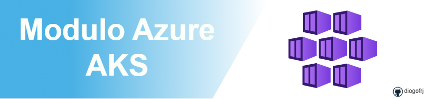

<!-- BEGIN_TF_DOCS -->
<!-- Título do Módulo -->
# 🌐 Terraform AzureRM - Azure Kubernetes Service



# 📚 Como utilizar este módulo

```hcl
# providers.tf
provider "azurerm" {
  features {
    resource_group {
      prevent_deletion_if_contains_resources = false
    }
  }
}
```

```hcl
# versions.tf
terraform {
  required_providers {
    azurerm = {
      source  = "hashicorp/azurerm"
      version = "~> 4.17.0"
    }
    random = {
      source  = "hashicorp/random"
      version = "~> 3.5.1"
    }
  }
  required_version = ">= 1.10.0"
}
```

```hcl
# main.tf
module "labels" {
  source       = "git::https://github.com/diogofrj/terraform-template-modules.git//examples/azure/labels?ref=v0.0.1"
  project      = "myapp"
  environment  = "dev"
  region       = "eastus2"
}

module "aks" {
  source = "../../"
  # Resource Group
  create_resource_group = true
  resource_group_name   = module.labels.resource_group_name
  location              = "eastus2"
  aks_name              = module.labels.aks_name
  dns_prefix            = trim(module.labels.aks_name, "-")
  default_node_pool_name = "default"
  default_node_pool_count = 1
  default_node_pool_vm_size = "Standard_DS2_v2"
  identity_type = "SystemAssigned"

  tags = {
    "project"     = "module-aks"
    "environment" = "dev"

  }
}
```
```hcl
# outputs.tf
output "client_certificate" {
  value     = module.aks.client_certificate
  sensitive = true
}

output "kube_config" {
  value     = module.aks.kube_config
  sensitive = true
}

output "aks_name" {
  value = module.aks.aks_name
}
```

## Índice

- [Requirements](#requirements)
- [Providers](#providers)
- [Modules](#modules)
- [Resources](#resources)
- [Inputs](#inputs)
- [Outputs](#outputs)

## Requirements

| Name | Version |
|------|---------|
| <a name="requirement_terraform"></a> [terraform](#requirement\_terraform) | >= 1.9, < 2.0 |
| <a name="requirement_azurerm"></a> [azurerm](#requirement\_azurerm) | ~> 4.17.0 |
| <a name="requirement_random"></a> [random](#requirement\_random) | ~> 3.5.1 |

## Providers

| Name | Version |
|------|---------|
| <a name="provider_azurerm"></a> [azurerm](#provider\_azurerm) | 4.17.0 |

## Modules

No modules.

## Resources

| Name | Type |
|------|------|
| [azurerm_kubernetes_cluster.aks](https://registry.terraform.io/providers/hashicorp/azurerm/latest/docs/resources/kubernetes_cluster) | resource |
| [azurerm_resource_group.rg](https://registry.terraform.io/providers/hashicorp/azurerm/latest/docs/resources/resource_group) | resource |
| [azurerm_resource_group.rgrp](https://registry.terraform.io/providers/hashicorp/azurerm/latest/docs/data-sources/resource_group) | data source |

## Inputs

| Name | Description | Type | Default | Required |
|------|-------------|------|---------|:--------:|
| <a name="input_aks_name"></a> [aks\_name](#input\_aks\_name) | Nome do cluster AKS | `string` | n/a | yes |
| <a name="input_default_node_pool_count"></a> [default\_node\_pool\_count](#input\_default\_node\_pool\_count) | Número de nós no pool padrão | `number` | n/a | yes |
| <a name="input_default_node_pool_name"></a> [default\_node\_pool\_name](#input\_default\_node\_pool\_name) | Nome do pool de nós padrão | `string` | n/a | yes |
| <a name="input_default_node_pool_vm_size"></a> [default\_node\_pool\_vm\_size](#input\_default\_node\_pool\_vm\_size) | Tamanho da VM do pool padrão | `string` | n/a | yes |
| <a name="input_dns_prefix"></a> [dns\_prefix](#input\_dns\_prefix) | Prefixo DNS para o cluster AKS | `string` | n/a | yes |
| <a name="input_identity_type"></a> [identity\_type](#input\_identity\_type) | Tipo de identidade do cluster AKS | `string` | n/a | yes |
| <a name="input_location"></a> [location](#input\_location) | Localização do Azure onde os recursos serão criados | `string` | n/a | yes |
| <a name="input_resource_group_name"></a> [resource\_group\_name](#input\_resource\_group\_name) | Nome do grupo de recursos | `string` | n/a | yes |
| <a name="input_create_resource_group"></a> [create\_resource\_group](#input\_create\_resource\_group) | Controla se o grupo de recursos deve ser criado (true) ou usar um existente (false) | `bool` | `true` | no |
| <a name="input_tags"></a> [tags](#input\_tags) | Tags a serem aplicadas aos recursos | `map(string)` | `{}` | no |

## Outputs

| Name | Description |
|------|-------------|
| <a name="output_aks_name"></a> [aks\_name](#output\_aks\_name) | n/a |
| <a name="output_client_certificate"></a> [client\_certificate](#output\_client\_certificate) | n/a |
| <a name="output_kube_config"></a> [kube\_config](#output\_kube\_config) | n/a |

<h2 align="left">Contatos:</h2>
<p align="left">
    <a href="https://linkedin.com/in/diogofernandesrj" target="blank"></a>
    <a href="mailto:dfs@outlook.com.br" target="blank"></a>
</p>

Obrigado por utilizar este módulo de Terraform! Se tiver alguma dúvida ou sugestão, não hesite em entrar em contato.

[🔝 Voltar ao topo](#footer)
<!-- END_TF_DOCS -->
